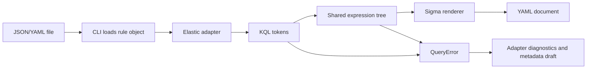

# KQL parser: design and implementation

This document describes the current implementation of [kql.py](kql.py). It supplements the approved [feature design](../../docs/design.md); it does not expand the accepted language or change conversion behavior.

## Purpose and boundaries

The parser translates a bounded subset of Elastic KQL into a vendor-neutral Boolean expression. That subset supports the human-provided PowerShell fixture while keeping the interpretation small enough to inspect and test.

It owns tokenization, precedence, grouping, allowed query fields, and comparison-to-model mapping. It does not read files, emit YAML, map threat metadata, infer log sources, or log to a stream. Those responsibilities belong to the surrounding adapter, metadata helpers, renderer, and CLI.



There is no query execution, network access, parser-generator dependency, or string evaluation. Regexes classify bounded fields/literals; recursive descent handles the Boolean structure.

## Public contract

```python
parse_query(query: str) -> Expression
```

- Input: the already-decoded KQL string, not a JSON/YAML document or Elastic rule mapping.
- Success: a `Match`, `And`, `Or`, or `Not` node from [models.py](../models.py).
- Expected parse failure: `QueryError`, a `ValueError` subclass with a reason and source offset in its message.
- Every call creates its own parser/token list; no parser state survives across conversions.
- Source positions refer to Python string indexes, starting at zero. They are character indexes, not UTF-8 byte offsets or line/column pairs.

The adapter checks missing/non-string/blank queries before calling this function. The direct parser API assumes a string; it is not a general input-validation boundary. Empty strings passed directly encounter the parser's expected-token error.

## Grammar

Keywords below match case-insensitively. Field names are case-sensitive.

```text
query             := or_expression END
or_expression     := and_expression (OR and_expression)*
and_expression    := unary (AND unary)*
unary             := NOT unary
                   | '(' or_expression ')'
                   | comparison
comparison        := exact_field ':' quoted_string
                   | 'process.command_line' ':' contains_term
                   | 'process.command_line' ':' contains_group
contains_group    := '(' contains_term AND contains_term (AND contains_term)* ')'
contains_term     := '*' literal '*'
```

A contains group requires at least two terms. Parentheses around one term, OR/NOT inside a field group, and nested field groups are not supported. Outer Boolean composition can combine whole groups:

```text
process.command_line:(*curl* AND *example.org*) AND NOT process.name: "trusted"
```

Precedence follows the call hierarchy: `expression` parses OR over complete AND expressions; `conjunction` parses AND over complete unary expressions; `unary` handles NOT and parentheses. Repeated AND or OR operations associate to the left. NOT associates through recursive unary parsing, so repeated NOT is supported.

For example:

```text
process.name: "a" OR process.name: "b" AND process.name: "c"
```

becomes `Or(a, And(b, c))`. Parenthesizing the OR changes it to `And(Or(a, b), c)` when followed by `AND process.name: "c"`. These are distinct trees and remain distinct Sigma conditions.

## Field and value policy

| Source field | Accepted value syntax | Shared Match field/operator |
| --- | --- | --- |
| `process.name` | Quoted exact string | `process.name`, `exact` |
| `process.executable` | Quoted exact string | `process.executable`, `exact` |
| `process.parent.name` | Quoted exact string | `process.parent.name`, `exact` |
| `process.parent.executable` | Quoted exact string | `process.parent.executable`, `exact` |
| `host.os.type` | Quoted exact string | `host.os.type`, `exact` |
| `event.category` | Quoted exact string | `event.category`, `exact` |
| `process.command_line` | One contains term | `CommandLine`, `contains` |
| `process.command_line` | Contains-AND group | `CommandLine`, `contains_all` |

`FIELD` accepts the lexical shape `[A-Za-z_][A-Za-z0-9_.]*`; passing that check does not grant support. `_Parser.comparison` also checks the explicit allowlist. The `CommandLine` rename happens in this Elastic-specific parser before shared rendering. The other supported fields retain their ECS names, so their deployment requires a compatible field mapping.

Quoted exact strings:

- Use double quotes and must decode to a nonempty string.
- Preserve spelling, case, spaces, and punctuation.
- Support only escaped double quotes (`\"`) and escaped backslashes (`\\`).
- Reject `*` and `?`, including inside the quotes.
- Do not support single-quoted values or escape forms such as `\n` and `\u1234` at the KQL layer.

The file decoder runs first. A JSON escape may therefore become an actual character before KQL tokenization. For example, the KQL text `process.executable: "C:\\Tools\\cmd.exe"` contains doubled backslashes, which the parser decodes once; JSON embedding would require an additional escaping layer. YAML block scalars can make the intended KQL text easier to read.

Contains terms:

- Have exactly one leading and one trailing `*` around a nonempty literal.
- Exclude whitespace, parentheses, colon, either quote character, backslash, `*`, and `?` from the literal.
- Permit dots and hyphens, so `*Net.WebClient*` and `*--decode*` work.
- Strip only the two enclosing stars and retain source order when constructing a tuple of values.

Only Boolean keywords are normalized to uppercase tokens. Values are not normalized. This parser does not establish backend case-sensitivity or analyzer equivalence.

## Implementation walkthrough

### 1. Tokenize into positioned tokens

`_tokens(query)` walks the decoded string once and produces `Token(kind, value, position)` instances:

| Token kind | Source | Stored value |
| --- | --- | --- |
| `(`, `)`, `:` | Punctuation | The punctuation itself |
| `STRING` | Double-quoted text | Decoded content without enclosing quotes |
| `AND`, `OR`, `NOT` | Standalone keyword in any case | Original spelling retained in value; kind normalized |
| `WORD` | Other runs up to whitespace or a punctuation/quote delimiter | Original text |
| `END` | Appended sentinel | Empty string, position equal to query length |

Whitespace outside quoted strings is skipped. Punctuation can directly adjoin neighboring tokens, as in `process.command_line:(*a* AND *b*)`. Quoted words such as `"AND OR NOT"` remain one STRING token.

Escapes are checked while scanning quoted text. An invalid escape or unterminated quote raises `QueryError` immediately. The entire token list is built before syntax parsing starts; a later lexical error can therefore be reported before an earlier unsupported field is examined. There is no multi-error recovery or guarantee that a reported error is the earliest possible semantic error.

### 2. Consume tokens with a cursor

`_Parser.position` indexes the token list. `current` reads the next token. `take(kind)` validates the expected kind and advances; otherwise it raises a positioned error. Parsing never modifies the input string or previously built nodes.

The END sentinel makes missing operands and trailing content diagnosable without consuming unrelated input. `parse_query` explicitly calls `take('END')` after constructing the expression: a valid prefix followed by extra text cannot succeed.

### 3. Build the Boolean tree

| Method | Responsibility |
| --- | --- |
| `expression()` | Parse one conjunction, then fold any following OR operands |
| `conjunction()` | Parse one unary expression, then fold any following AND operands |
| `unary()` | Handle recursive NOT, a parenthesized expression, or a comparison |
| `comparison()` | Validate field policy, consume the colon/value or field group, and return Match |
| `contains()` | Validate the WORD against CONTAINS and return its inner literal |

Exact strings create `Match(field, 'exact', (value,))`. A single command-line term creates `Match('CommandLine', 'contains', (value,))`. A group creates one `Match('CommandLine', 'contains_all', values)` instead of several unrelated predicates.

### 4. Hand the model to the shared renderer

`parse_query` does not choose selection names. [sigma.py](../sigma.py) names a standalone Match `selection`; compound expressions receive `selection_1`, `selection_2`, etc. in traversal order. Repeated field comparisons are separate selections, so later values cannot overwrite earlier ones.

The renderer maps exact to an unmodified key, contains to `|contains`, and contains_all to `|contains|all`. It fully parenthesizes Boolean conditions and does not simplify or optimize them.

## End-to-end worked example

Query:

```text
process.command_line:(*curl* AND *example.org*) AND NOT process.name: "trusted"
```

Model:

```python
And(
    Match('CommandLine', 'contains_all', ('curl', 'example.org')),
    Not(Match('process.name', 'exact', ('trusted',))),
)
```

Rendered detection:

```yaml
detection:
    selection_1:
        CommandLine|contains|all:
            - curl
            - example.org
    selection_2:
        process.name: trusted
    condition: (selection_1 and (not selection_2))
```

`contains_all` expresses the requirement that both substrings match. Changing it to a normal value list would change the intended logic. No executable-name or OS constraint is added by the parser; logsource inference happens separately in the metadata helper.

## Error propagation and incomplete output

For this query:

```text
process.name: "bash" AND unsupported.field: "x"
```

`QueryError` reports `Unsupported field at character 25; detection omitted.` The reason identifies syntax/policy failure without including the input value or whole query.

`ElasticAdapter._detection` catches QueryError and records an `unsupported_query` diagnostic at path `query`. It also records `incomplete_detection` and returns no expression. Valid title/description/other independent metadata still convert. The renderer emits status unsupported and no detection section.

The same rule applies when an unsupported predicate appears under OR or NOT. Removing it could broaden or narrow the detection, so partial syntax trees are never published. This is the boundary between best-effort metadata translation and atomic detection translation.

The adapter also decides whether parsing is appropriate at all. Explicit unsupported languages/types or extra semantic settings prevent detection translation; they are not passed to this parser and guessed into KQL.

## Complexity and practical limits

For input length n, tokenization and ordinary parsing perform linear work and store O(n) tokens/tree nodes. Recursive calls are proportional to nested parentheses/NOT; the resulting tree can also be deep for long left-associated Boolean chains.

There are currently no explicit input-size, token-count, or nesting limits. Extremely deep expressions can exceed Python's recursion limit in parsing, metadata traversal, or rendering. This resource-limit case is not covered by the reviewed suite and is not converted into a QueryError. Do not infer adversarial-input robustness from the existing tests.

The complete conversion pipeline is not claimed to be O(n): repeated condition-string construction in the renderer can copy growing strings for deep trees. Iterative traversal and controlled limits are possible follow-up work, subject to review.

## Existing tests and reading route

Tests exercise public conversion/model contracts; they do not couple expected output to private token arrays or parser helper methods.

| Cases | What they verify |
| --- | --- |
| T-01 | Exact field preservation and the human-provided contains-all fixture |
| T-02/T-03 | Precedence, grouping, negation, repeated fields, and independent Boolean truth tables |
| T-04 | Keyword casing, nested NOT, quoted operator words, quotes/backslashes |
| T-08/T-09 | Unsupported constructs, full consumption, malformed input, and positioned error messages |
| T-17/T-18 | Generalized contains terms/groups and their use in outer Boolean expressions |
| T-24 | Unsupported predicates are not silently discarded, including under OR/NOT |
| T-27 | Shared-model rendering independently of Elastic input mappings |
| R-04 | A real Linux KQL rule outside the subset produces a diagnosed draft |

Start with [test_converter.py](../../tests/test_converter.py), then [test_sigma.py](../../tests/test_sigma.py) and [the Linux comparison guide](../../tests/fixtures/linux/README.md). Tests prove the approved subset; they are not full KQL conformance tests or live SIEM equivalence checks.

## Extension decisions

For an additional exact field, review its source semantics and desired Sigma field name, then update the documented policy and tests before extending comparison mapping. Adding a field can also affect the process-only logsource heuristic in elastic_metadata.py, so review the whole resulting document.

For a new operator or field-group form, define precedence, accepted values, missing-field behavior, and a faithful shared representation. If existing Match operators cannot represent it, extend the shared model and renderer under design review. Do not approximate unsupported predicates by dropping terms.

For another vendor, implement VendorAdapter with its own parser and metadata mapping. Reuse Match/And/Or/Not and the Sigma renderer where semantics fit. Vendor selection remains outside the current file-only Elastic CLI contract.

The [repository workflow](../../docs/workflow.md) requires human approval for changed behavior and an assigned test author before production changes. This guide documents current code and adds no new parsing features.
